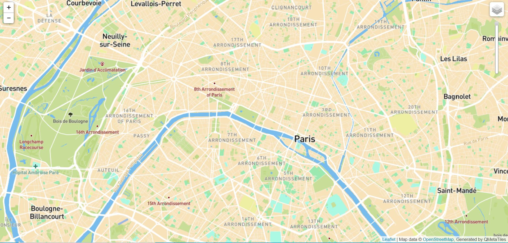

# My Maptiles
### :pushpin: My Tiles
I used <a href="https://www.mapbox.com/">Mapbox</a> for creating my own basemap. There are largely 6 options to make the creative basemaps.
> Basic
> Monochrome
> Streets
> Outdoors
> Satellite Streets
> Navigation

I decided to use **"Basic"** map as the foundation for my own basemap because it is easy to view the large area (water, grounds, and attractions).

Base color was changed from light brown to darker, yellowish brown to differentiate the land use more clearly.

Some colors of interest labels have transformed as well. 
`Hospitals) red -> light green`  
`Schools) brown -> dark green`  
`Points of interest) greyish brown -> dark red`
### :memo: Map

The area is strictly focusing on *Paris, France*. Reasons to choose this are are,
- having river, greens, and Streets
- historical viewpoints are gathered around the city

##### Zoom Levels
>`Maximum zoom level: 15`  
-> upto small roads of Paris  
>`Minimum zoom level: 4`  
-> by the country  
>`Fixed zoom level when opened: 13` 
-> village and sub-areas of the city
